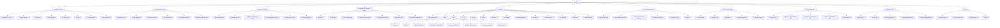

# ANSLIFE Sitemap

```mermaid
graph TD
  A[ANSLIFE]

  A --> B[Giới thiệu về Anslife]
  B --> B1[Giới thiệu về công ty]
  B --> B2[Tầm nhìn, sứ mệnh]
  B --> B3[Giá trị cốt lõi]
  B --> B4[Triết lý vận hành]
  B --> B5[Cơ cấu tổ chức]
  B --> B6[Đội ngũ]
  B --> B7[Hệ sinh thái Anslife]
  B --> B8[Lịch sử phát triển]

  A --> C[Hệ sinh thái sản xuất]
  C --> C1[Hệ thống sản xuất]
  C --> C2[Vùng nguyên liệu]
  C --> C3[Thiết bị & công nghệ]
  C --> C4[Quy trình sản xuất]
  C --> C5[Tiêu chuẩn & chứng chỉ]
  C --> C6[Đăng ký đối tác sản xuất]

  A --> D[Năng lực sản xuất]
  D --> D1[Quy mô hệ sinh thái]
  D --> D2[Công suất sản xuất]
  D --> D3[Năng lực phát triển sản phẩm]
  D --> D4[Khả năng xử lý đơn hàng]
  D --> D5[Sản xuất theo yêu cầu]
  D --> D6[Thị trường xuất khẩu]

  A --> E[Hệ thống kiểm soát chất lượng]
  E --> E1[Triết lý QC]
  E --> E2[Hệ thống QC]
  E --> E3[Kiểm tra nguyên liệu]
  E --> E4[Kiểm tra trong sản xuất]
  E --> E5[Kiểm tra trước xuất hàng]
  E --> E6[Quy trình xử lý lỗi]
  E --> E7[Case cải tiến chất lượng]

  A --> F[Sản phẩm]
  F --> F1[Sofa - Ghế thư giãn]
  F --> F2[Bàn]
  F2 --> F2a[Bộ bàn ăn]
  F2 --> F2b[Bàn ăn]
  F2 --> F2c[Bàn Cafe - Bàn trà]
  F2 --> F2d[Bàn Console - Kệ Console]
  F2 --> F2e[Bàn Lamp - Bàn góc]
  F2 --> F2f[Bàn học - Bàn làm việc]
  F2 --> F2g[Bàn - Tủ trang điểm]
  F2 --> F2h[Bàn ngoài trời]
  F --> F3[Ghế]
  F --> F4[Tủ - Kệ]
  F --> F5[Giường]
  F --> F6[Đệm]
  F --> F7[Đồ trang trí]
  F --> F8[Đồ gia dụng]
  F --> F9[Không gian ngoài trời]
  F --> F10[Đồ cho bé]
  F --> F11[BÁN CHẠY NHẤT]
  F --> F12[BỘ SƯU TẬP]
  F --> F13[GIẢM GIÁ]
  F --> F14[SẢN PHẨM MỚI]

  A --> G[Quy trình thương mại]
  G --> G1[Quy trình đặt hàng]
  G --> G2[Quy trình phát triển mẫu]
  G --> G3[Điều kiện giao hàng Incoterms]
  G --> G4[Phương thức thanh toán]
  G --> G5[Thời gian sản xuất]
  G --> G6[Logistics]

  A --> H[Dự án & Case Study]
  H --> H1[Dự án xuất khẩu]
  H --> H2[Case sản xuất]
  H --> H3[Case cải tiến]
  H --> H4[Hình ảnh giao hàng]
  H --> H5[Hình ảnh container]

  A --> I[Hệ thống toàn cầu]
  I --> I1[Việt Nam - Trụ sở]
  I --> I2[Singapore - Văn phòng đại diện]
  I --> I3[Nhật Bản - Văn phòng đại diện]
  I --> I4[Hoa Kỳ - Văn phòng đại diện]
  I --> I5[Đối tác quốc tế]

  A --> J[Phụng sự xã hội]
  J --> J1[Giới thiệu triết lý]
  J --> J2[Quỹ học bổng]
  J --> J3[Hoạt động cộng đồng]
  J --> J4[Phát triển nguồn nhân lực]
  J --> J5[Tham gia cùng ANSLIFE]

  A --> K[Liên hệ]
  K --> K1[Thông tin công ty]
  K --> K2[Gửi yêu cầu báo giá]
  K --> K3[Đặt lịch làm việc]
  K --> K4[Bản đồ]
```
