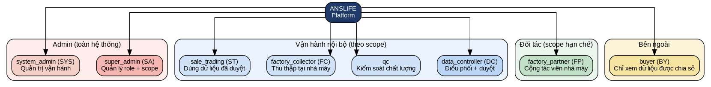
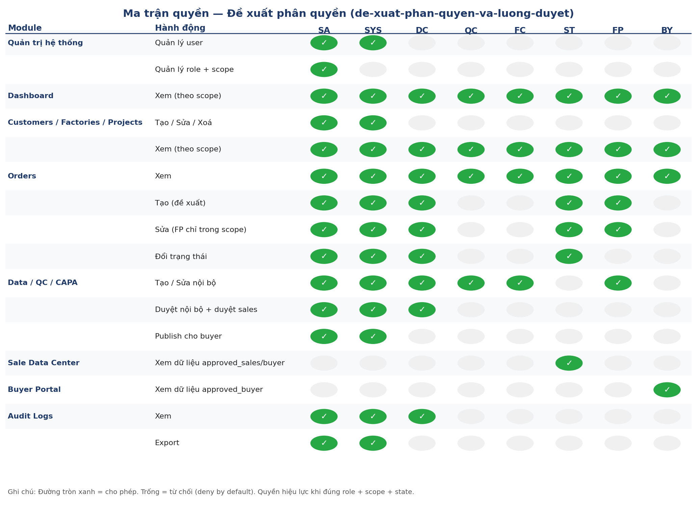
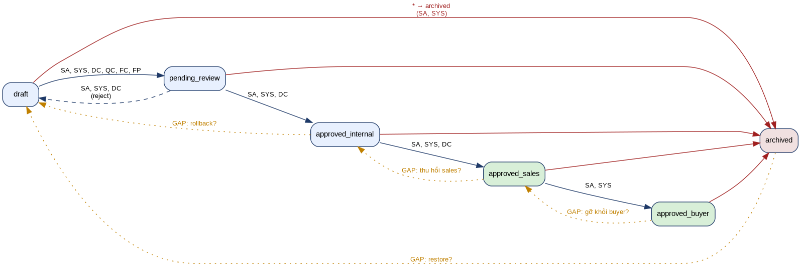

# ĐỀ XUẤT PHÂN QUYỀN VÀ LUỒNG DUYỆT (BẢN ĐỂ ANH DUYỆT NHANH)

Ngày tạo: 27/04/2026
Bản cập nhật: 30/04/2026 — đồng bộ với baseline `permission-matrix-v1.md`, bổ sung nhánh rollback/restore và scope; xem chi tiết review tại [`docs/review-phan-quyen.md`](./review-phan-quyen.md).

Tài liệu này em chủ động dựng trước để anh duyệt nhanh khi chưa chốt hết yêu cầu chi tiết.

## 1. Cách dùng tài liệu này
- Anh xem từng mục và phản hồi theo dạng: `Giữ nguyên` hoặc `Chỉnh`.
- Nếu `Chỉnh`, anh chỉ cần ghi ngắn: role nào, quyền nào, sửa thành gì.
- Sau vòng duyệt đầu, em cập nhật thành bản chốt để đưa vào code.

## 2. Danh sách role đề xuất



| Role | Mô tả ngắn | Scope mặc định |
| --- | --- | --- |
| `super_admin` | Chủ hệ thống, toàn quyền | Toàn hệ thống |
| `system_admin` | Quản trị vận hành, quản lý user và cấu hình | Toàn hệ thống |
| `data_controller` | Điều phối dữ liệu, duyệt nội bộ | Theo vùng phụ trách hoặc toàn hệ thống |
| `qc` | Kiểm soát chất lượng, xử lý dữ liệu QC | Theo scope được gán |
| `factory_collector` | Thu thập dữ liệu từ nhà máy | Theo scope được gán |
| `sale_trading` | Theo dõi dữ liệu đã duyệt cho sale | Theo scope được gán |
| `factory_partner` | Cộng tác viên nhà máy, nhập/cập nhật dữ liệu liên quan | Theo scope được gán |
| `buyer` | Khách mua, chỉ xem dữ liệu đã public cho buyer | Chỉ dữ liệu được chia sẻ |

### 2.1. Mô hình scope

Scope là tập hợp các chiều giới hạn dữ liệu mà role được phép truy cập. Đề xuất 4 chiều scope chuẩn:

- `factory_id`: giới hạn theo nhà máy.
- `customer_id`: giới hạn theo khách hàng.
- `project_id`: giới hạn theo dự án.
- `region`: giới hạn theo vùng địa lý (ví dụ vùng phụ trách của `data_controller`).

Quy tắc kết hợp: scope là phép giao (AND) của các chiều được gán. Role admin (`super_admin`, `system_admin`) bỏ qua scope cho tác vụ quản trị.

## 3. Khung phân quyền nghiệp vụ (đề xuất)

Viết tắt role:
- `SA`: `super_admin`
- `SYS`: `system_admin`
- `DC`: `data_controller`
- `QC`: `qc`
- `FC`: `factory_collector`
- `ST`: `sale_trading`
- `FP`: `factory_partner`
- `BY`: `buyer`



```text
+-----------------------------------------------------------------------+
| KHUNG 1 - QUAN TRI HE THONG                                           |
| Module: User / Role / Scope                                           |
| - Quan ly user: SA, SYS                                               |
| - Quan ly role + scope: SA                                            |
+-----------------------------------------------------------------------+
| KHUNG 2 - DASHBOARD                                                   |
| - Tat ca role duoc xem dashboard theo scope:                          |
|   SA, SYS, DC, QC, FC, ST, FP, BY                                     |
+-----------------------------------------------------------------------+
| KHUNG 3 - CUSTOMERS / FACTORIES / PROJECTS                            |
| - Tao / Sua / Xoa: SA, SYS                                            |
| - Xem (theo scope): SA, SYS, DC, QC, FC, ST, FP                       |
| - BY chi xem PROJECTS duoc share, KHONG xem danh muc                 |
|   Customers/Factories.                                                |
+-----------------------------------------------------------------------+
| KHUNG 4 - ORDERS                                                      |
| - Xem: tat ca role theo scope                                         |
|   SA, SYS, DC, QC, FC, ST, FP, BY                                     |
| - Tao: SA, SYS, DC, ST                                                |
| - Sua: SA, SYS, DC, ST, FP (FP chi sua trong scope)                  |
| - Doi trang thai: SA, SYS, DC, ST                                     |
+-----------------------------------------------------------------------+
| KHUNG 5 - DATA / QC / CAPA ITEM                                       |
| - Tao / Sua noi bo: SA, SYS, DC, QC, FC, FP                          |
| - Duyet noi bo (pending_review -> approved_internal): SA, SYS, DC    |
| - Duyet sales (approved_internal -> approved_sales): SA, SYS, DC     |
| - Publish cho buyer (approved_sales -> approved_buyer): SA, SYS      |
+-----------------------------------------------------------------------+
| KHUNG 6 - SALE DATA CENTER                                            |
| - Xem du lieu da duyet sales/buyer: ST (theo scope)                  |
+-----------------------------------------------------------------------+
| KHUNG 7 - BUYER PORTAL                                                |
| - Xem du lieu approved_buyer: BY (du lieu duoc chia se)              |
+-----------------------------------------------------------------------+
| KHUNG 8 - AUDIT LOGS                                                  |
| - Xem log: SA, SYS, DC                                                |
| - Export log: SA, SYS                                                 |
+-----------------------------------------------------------------------+
| KHUNG 9 - LEGACY SUPPLIER_MATERIAL (LOCK)                             |
| - Chi SA, SYS duoc truy cap.                                          |
| - Non-admin luon tra 403 cho endpoint legacy.                         |
+-----------------------------------------------------------------------+
```

> Lưu ý đối chiếu với `permission-matrix-v1.md`:
> - Orders: `factory_partner` chỉ được Sửa trong scope, KHÔNG được Tạo.
> - Buyer: scope là "chỉ dữ liệu được chia sẻ", không liệt kê BY ở danh mục Customers/Factories.
> - `supplier_material` là module legacy đã khoá ở mức admin.

## 4. Khung luồng duyệt dữ liệu (đề xuất)



```text
+---------+     +----------------+     +------------------+
|  draft  | --> | pending_review | --> | approved_internal|
+---------+     +----------------+     +------------------+
     ^                  |                       |
     |                  v                       v
     |          +---------------+      +------------------+
     |          | (reject:      |      | approved_sales   |
     |          |  back to      |      +------------------+
     |          |  draft)       |              |
     |          +---------------+              v
     |                                +------------------+
     |                                | approved_buyer   |
     |                                +------------------+
     |                                         |
     v                                         v
+----------+ <--------------------------- (rollback/restore)
| archived |
+----------+
```

Ý nghĩa trạng thái:
- `draft`: Dữ liệu mới tạo/chưa gửi duyệt.
- `pending_review`: Đã gửi, chờ duyệt nội bộ.
- `approved_internal`: Đã duyệt nội bộ.
- `approved_sales`: Đã duyệt cho sale sử dụng.
- `approved_buyer`: Đã duyệt để buyer xem.
- `archived`: Đóng lưu trữ, không xử lý tiếp.

## 5. Khung quyền chuyển trạng thái (đề xuất)

```text
+----------------------------------------------------------------------------------+
| Forward (đẩy lên cấp cao hơn)                                                    |
| draft -> pending_review              : SA, SYS, DC, QC, FC, FP                  |
| pending_review -> approved_internal  : SA, SYS, DC                              |
| approved_internal -> approved_sales  : SA, SYS, DC                              |
| approved_sales -> approved_buyer     : SA, SYS                                  |
+----------------------------------------------------------------------------------+
| Rollback (kéo về cấp thấp hơn để sửa)  -- BỔ SUNG MỚI                           |
| pending_review -> draft              : SA, SYS, DC  (reject, bắt buộc lý do)    |
| approved_internal -> draft           : SA, SYS, DC  (yêu cầu sửa, có lý do)     |
| approved_sales -> approved_internal  : SA, SYS, DC  (thu hồi sales)             |
| approved_buyer -> approved_sales     : SA, SYS      (gỡ khỏi buyer)             |
+----------------------------------------------------------------------------------+
| Archive / Restore                                                                |
| * -> archived                        : SA, SYS                                  |
| archived -> draft                    : SA, SYS  (restore khi archive nhầm)      |
+----------------------------------------------------------------------------------+
```

> Lưu ý: nhánh forward giữ nguyên theo baseline `permission-matrix-v1.md`. Các nhánh rollback và `archived → draft` là phần bổ sung của bản review để xử lý trường hợp dữ liệu sai sót sau khi đã duyệt — anh chốt giúp có lấy hay không.

## 6. Quy tắc bảo vệ dữ liệu
- `Deny by default`: mặc định không có quyền nếu chưa được cấp.
- Quyền chỉ có hiệu lực khi đúng `role + scope + state`.
- Tất cả hành động quan trọng phải ghi `audit log`.
- Mỗi thao tác rollback (`pending_review/approved_* -> trạng thái thấp hơn`) phải kèm lý do bắt buộc.
- Role legacy chỉ để tương thích dữ liệu cũ, không dùng làm chuẩn nghiệp vụ mới.
- Module `supplier_material` (legacy) chỉ SA/SYS truy cập; non-admin trả 403.

## 7. Các điểm anh cần chốt

Mỗi điểm anh có thể trả lời ngắn ngay dưới (`> Đáp án:`).

1. Có giữ đủ 8 role như đề xuất hay gộp `super_admin` + `system_admin` còn 7 role?
   > Đáp án:

2. `factory_partner` chỉ được Sửa orders trong scope (không Tạo) — đúng theo baseline V1, anh xác nhận?
   > Đáp án:

3. `sale_trading` có quyền đổi trạng thái đơn hàng tới mức nào? (hiện đề xuất: tất cả các bước đổi trạng thái của order)
   > Đáp án:

4. Có cho `data_controller` quyền export audit log hay không (hiện đề xuất: KHÔNG)?
   > Đáp án:

5. Có chấp nhận các nhánh rollback bổ sung ở Section 5 (`approved_internal → draft`, `approved_sales → approved_internal`, `approved_buyer → approved_sales`, `archived → draft`) hay không?
   > Đáp án:

6. Order có lifecycle riêng (ngoài state machine của Data) — cần bản đặc tả chi tiết các trạng thái order; anh xác nhận để em mở doc bổ sung?
   > Đáp án:
